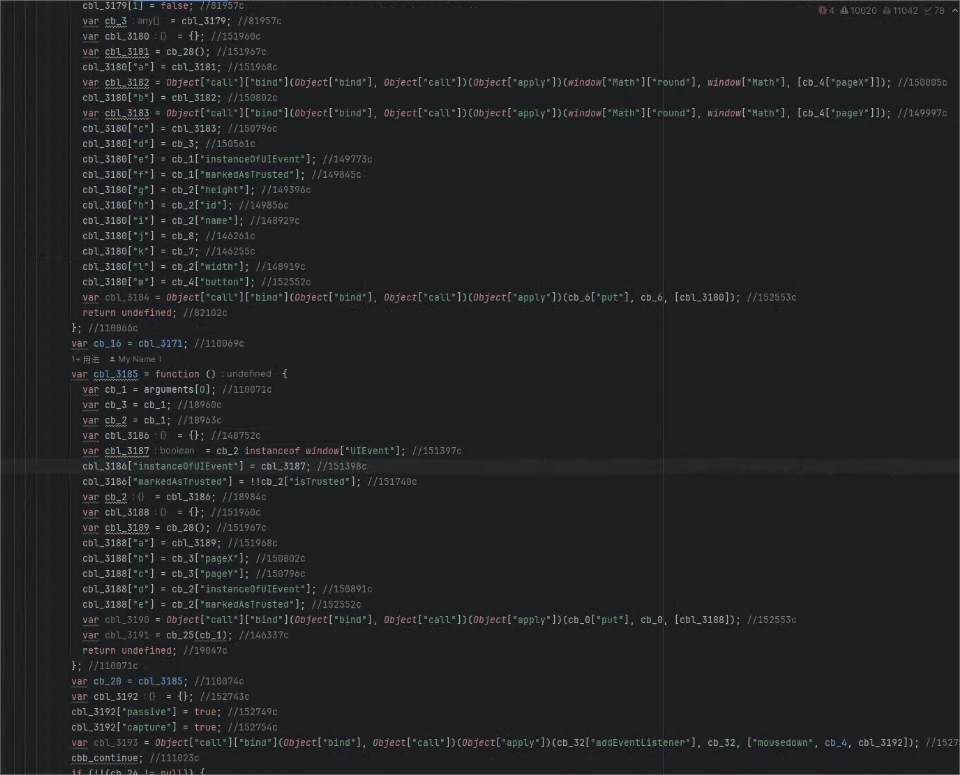
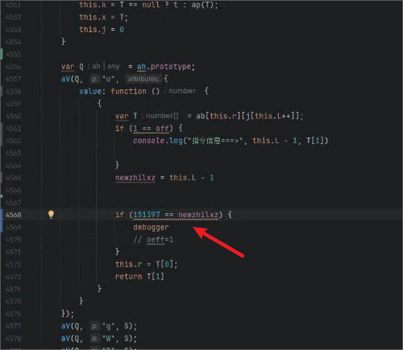
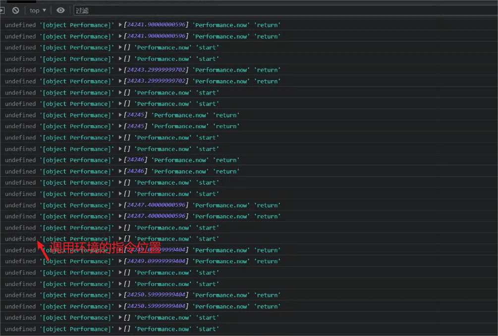
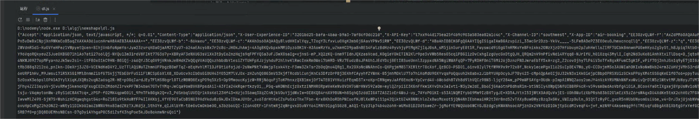
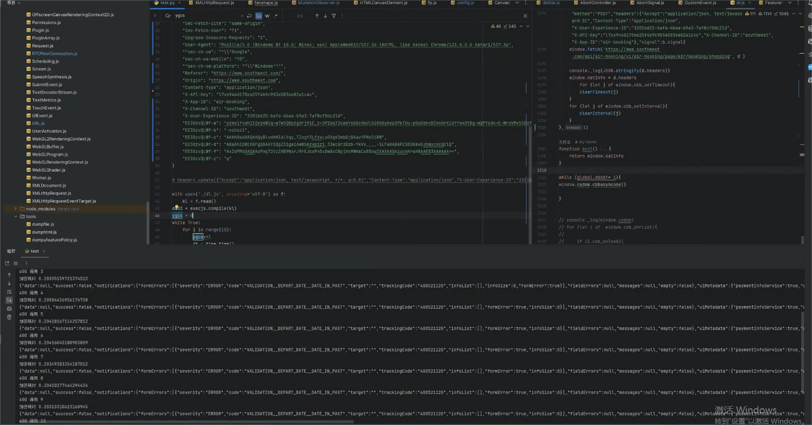

# 最新shape西南滑块逆向分析 
在web逆向中shape现在属于天花板有着很强的风控和很难反编译的vmp

在这种情况下我们如何去分析其检测点或者还原其算法

接下来我会说一下我的逆向思路

## 1.反编译shape(对于shape而言不管是算法分析还是补环境都是很重要)

完美反编译shape难度很高，里面存在虚假分支，且指令不连续不好确定语法结构，我采用的是反编译伪代码
下面是我反编译的最新版的shape比之前开源的星巴克的shape反编译代码好很多
 


## 2.实现简单的调试器功能
反编译伪代码后我们就要对这个shape的vmp做一个简单的调试器功能，在上图中有很多//18984c，这样子的注释,这些其实就是这段代码所代表的指令位置。假设我们需要再下面代码位置断点
```javascript
var cbl_3187 = cb_2 instanceof window["UIEvent"]; //151397c
```
我们需要再指令跳转位置插入这段代码去断点151397如下图
 
这样子我们就可以对伪代码上想断点的位置进行断点查看变量。

## 3.补环境获得加密参数
使用卷卷大陆星球挽风开源的浏览器打印环境调用
   下面我使用的是我自己的魔改浏览器打印的
    
上图第一个位置是调用的指令位置(我这里没有打印), 通过这个可以去找伪代码的位置从而确定检查点
然后就开始嘎嘎补(我这里没有补多少)

## 4.参数生成
```javascript
setTimeout(() => {
 
    let gg = {
        "Accept": "application/json, text/javascript, */*; q=0.01",
        "Content-Type": "application/json",
        "X-User-Experience-ID": "3201bd25-bafa-4baa-b9a3-7af8cf0dc21d",
        "X-API-Key": "l7xx944d175ea25f4b9c903a583ea82a1c4c",
        "X-Channel-ID": "southwest",
        "X-App-ID": "air-booking"
    }
    let b = new window.AbortController()
    d = {
        "body": "{\"originationAirportCode\":\"MSY\",\"destinationAirportCode\":\"ABQ\",\"departureDate\":\"2024-04-11\",\"returnDate\":\"2024-04-14\",\"departureTimeOfDay\":\"ALL_DAY\",\"returnTimeOfDay\":\"ALL_DAY\",\"adultPassengersCount\":\"1\",\"tripType\":\"roundtrip\",\"fareType\":\"USD\",\"passengerType\":\"ADULT\",\"adultsCount\":\"1\",\"from\":\"MSY\",\"int\":\"HOMEQBOMAIR\",\"reset\":\"true\",\"to\":\"ABQ\",\"application\":\"air-booking\",\"site\":\"southwest\"}",
        "method": "POST",
        "headers": gg,
        "signal": b.signal
    }
    window.fetch('https://www.southwest.com/api/air-booking/v1/air-booking/page/air/booking/shopping', d)
}, 1)
```
补完环境后调用上面代码就可以生成header的加密参数了

## 5.结果测试
成功跑起来

## 6.风控问题
虽然上面可以跑起来但是风控还是麻烦的不行，不能跑多，风控得自己慢慢解决了
有问题卷卷大陆交流
